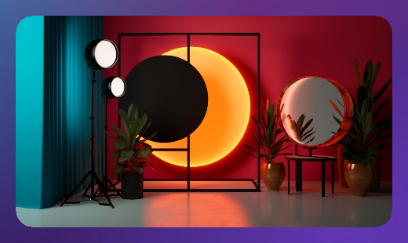
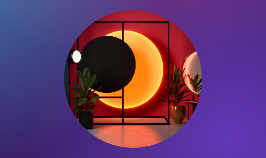
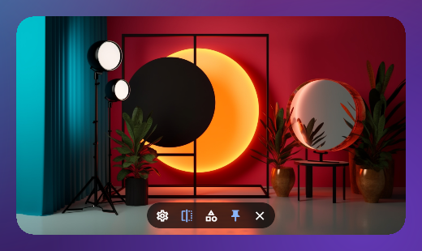
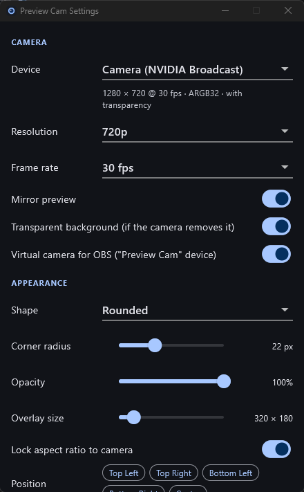
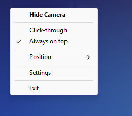

# Preview Cam

**Website:** <https://otabekoff.github.io/preview-cam/> · [Download](https://otabekoff.github.io/preview-cam/download) · [Privacy policy](https://otabekoff.github.io/preview-cam/privacy)

A floating webcam self-view for Windows 11: a frameless, transparent,
always-on-top overlay that shows your camera in a corner of the screen while
you work in other applications — for example while OBS Studio is recording.

The camera *is* the window. There is no title bar, border or toolbar; controls
appear only while the mouse is over the picture.


| Rounded | Circle | Hover controls |
| --- | --- | --- |
|  |  |  |

| Settings | Tray menu |
| --- | --- |
|  |  |

## Download

Get the latest installer (`PreviewCam-Setup-<version>.exe`) or the portable
zip from the [Releases](https://github.com/otabekoff/preview-cam/releases)
page. Windows 10/11, 64-bit. Releases are not code-signed yet (see
[Code signing policy](#code-signing-policy)), so Windows SmartScreen asks for
confirmation the first time: *More info → Run anyway*.

## Features

- Live camera preview, rendered through a Flutter texture (no frames in Dart)
- Works with physical webcams and virtual cameras, including
  "Camera (NVIDIA Broadcast)" and "OBS Virtual Camera"
- Cameras that remove the background (NVIDIA Broadcast → Virtual background →
  Remove) are shown as a cut-out directly on the desktop, using the camera's
  own alpha channel
- Shapes: rectangle, rounded rectangle, circle, 16:9 rounded, 4:3 rounded —
  everything outside the shape is genuinely transparent, to the eye and to
  the mouse
- Always on top, optional click-through, optional taskbar button
- Drag anywhere to move; drag the edges/corners to resize (native move/size
  loops, optional aspect-ratio lock)
- Mirror, opacity, corner radius, size
- Position presets (corners, centre) that respect the taskbar
- Remembers position, size and monitor; handles mixed-DPI multi-monitor
  setups and unplugged monitors
- Configurable global hotkeys
- A "Preview Cam" virtual camera that hands the finished, shaped picture to
  OBS with transparent corners
- English, Uzbek and Russian user interface (Settings → Language)
- System-tray icon and menu; closing the overlay hides it to the tray
- Start with Windows (no administrator rights)
- Clear in-overlay messages when the camera is missing, busy, blocked or
  unplugged, with automatic recovery when it comes back

## Build and run

Requirements: Flutter (stable, 3.47 or newer) with Windows desktop support and
Visual Studio with the "Desktop development with C++" workload.

```
flutter pub get
flutter run -d windows
```

Release build:

```
flutter build windows --release
```

The result is `build\windows\x64\runner\Release\preview.exe` plus the files
next to it; copy the whole `Release` folder to install it somewhere.

Checks:

```
flutter analyze
flutter test
```

### Installer

Releases are built by GitHub Actions (`.github/workflows/release.yml`): set
the version in `pubspec.yaml`, then push a matching tag such as `v0.0.1`. To
build the same files locally:

`installer\build.ps1` builds the release application and packages it with
[NSIS](https://nsis.sourceforge.io) (which must be installed, or pass
`-MakeNsis <path to makensis.exe>`):

```
powershell -ExecutionPolicy Bypass -File installer\build.ps1
```

The results are `build\installer\PreviewCam-Setup-<version>.exe` and a
portable zip, with the version taken from `pubspec.yaml`. The installer
installs for the current user without
administrator rights into `%LOCALAPPDATA%\Programs\Preview Cam`, bundles the
Visual C++ runtime, adds a Start menu shortcut (desktop shortcut optional) and
registers an uninstaller under Settings → Apps. Uninstalling keeps your
settings unless you choose to remove them. `/S` installs or uninstalls
silently.

Local builds are not code-signed. Signing of published releases is described
in [docs/SIGNING.md](docs/SIGNING.md).

## Using it

| Action | How |
| --- | --- |
| Move | Drag anywhere on the picture |
| Resize | Drag an edge or corner (the cursor changes; for a circle, the rim) |
| Controls | Hover: settings, mirror, next shape, always on top, hide |
| Hide / show | `×` in the controls, tray icon click, or `Ctrl + Alt + V` |
| Click-through | `Ctrl + Alt + C` or the tray menu |
| Bigger / smaller | `Ctrl + Alt + =` / `Ctrl + Alt + -` |
| Back to bottom-right | `Ctrl + Alt + B` |
| Settings | `⚙`, tray menu, or `Ctrl + Alt + S` |
| Quit | Tray menu → Exit |

All shortcuts can be changed or removed in Settings → Global hotkeys. A
warning icon next to a shortcut means another application already owns that
combination.

While click-through is on, the overlay cannot be clicked at all — that is the
point — so turn it off with the shortcut or from the tray menu. The setting is
remembered across restarts.

Starting the application a second time just brings the running overlay back.
(Development builds behave differently on purpose: `flutter run` asks a
running copy to exit and takes its place.)

### With OBS Studio

Preview Cam opens the camera for itself, exactly like any other camera
application; it has no connection to OBS and changes nothing on the device
(mirroring, for instance, is applied to this preview only).

Whether two applications can read one physical camera at the same time is up
to the camera driver and to whoever opened it first. When the camera is held
by another application the overlay shows "Camera in use" rather than an empty
window. In that case pick another device in Settings → Camera — any camera
Windows lists there can be selected, including virtual cameras.

A setup that avoids the problem entirely: let one application own the
physical webcam and have everything else read a virtual camera. For example,
NVIDIA Broadcast owns the webcam, and both OBS and Preview Cam use
"Camera (NVIDIA Broadcast)"; or OBS owns it and Preview Cam shows
"OBS Virtual Camera" (after *Start Virtual Camera* in OBS).

### Recording a single window (OBS Window Capture)

A Window Capture source records one window only, so an overlay floating above
that window is not part of the recording. Two ways to get the camera in:

- **Use the Preview Cam virtual camera** (what you see is what is recorded):
  switch on Settings → Camera → *Virtual camera for OBS*, then in OBS add a
  *Video Capture Device* source and choose the device **Preview Cam**. It
  delivers the finished picture — cropped like the overlay, mirrored if
  mirroring is on, in the overlay's shape — with a real alpha channel, so
  rounded corners, the circle and a removed background are transparent in
  OBS. The hover controls and messages are not part of it.
- **Add the camera to the scene directly**: add a *Video Capture Device*
  source and pick the same camera the overlay uses, e.g.
  "Camera (NVIDIA Broadcast)". You get the plain rectangular picture and
  shape it with OBS filters.

- **Capture the overlay as a window**: add a second *Window Capture* source
  and choose `[preview.exe]: Preview Cam`. This needs Settings → Behavior →
  *Allow window capture* (on by default). OBS draws captured windows opaque,
  so the area outside a rounded or circular shape comes out black; use the
  virtual camera when you need transparency.

*Allow window capture* decides how the overlay is hidden from the taskbar.
On, it stays an ordinary window that capture tools list, and it can appear in
Alt+Tab. Off, it becomes a tool window: never in Alt+Tab, but also not in
OBS's window list.

Notes on the virtual camera:

- The picture has the overlay's aspect ratio at the camera's resolution
  (for example 1080 × 1080 for a circle from a 1080p camera). If you change
  the shape while OBS is using the camera, the new picture is fitted inside
  the old size until you deactivate and reactivate the source in OBS.
- While Preview Cam is not running, or the overlay is hidden, the device
  delivers a fully transparent picture.
- It is registered for the current Windows user only (no administrator
  rights) and removed again when the setting is switched off or the
  application is uninstalled. Any DirectShow application that accepts
  ARGB video can use it.
- Frames are only prepared while some application is actually reading the
  camera.

### Transparent background

If the selected camera delivers an alpha channel, the overlay shows only the
non-transparent part of the picture and the desktop everywhere else. With
NVIDIA Broadcast: enable *Virtual background → Remove*, then choose
"Camera (NVIDIA Broadcast)" in Settings → Camera. Settings shows
`ARGB32 · with transparency` when this is active. Switch
"Transparent background" off to get a black background instead. The shape
(circle, rounded, …) still clips the picture, so the plain rectangle is
usually the best choice for a cut-out.

The camera is released whenever the overlay is hidden.

## Settings and data

Settings are stored as one JSON document via `shared_preferences`:

```
%APPDATA%\uz.nurafshon\Preview Cam\shared_preferences.json
```

Delete that file to reset everything, including the first-launch hint.
"Start with Windows" is a value named `PreviewCam` under
`HKCU\Software\Microsoft\Windows\CurrentVersion\Run`.

## Project layout

```
lib/
  main.dart                      entrypoints: main (overlay), settingsMain (settings window)
  app/app.dart                   root widget of the overlay
  camera/
    camera_backend.dart          camera API seam + Windows (DirectShow) binding
    camera_controller.dart       camera state machine (open, errors, hot-plug recovery)
    camera_device.dart           device identity
    camera_view.dart             texture + status/error panel
  overlay/
    overlay_controller.dart      coordinator: settings -> native window, camera, tray, hotkeys
    overlay_window.dart          window geometry across monitors and DPI
    overlay_view.dart            shape clipping, hover handling, toast, first-launch hint
    overlay_controls.dart        hover control strip
  settings/
    settings_model.dart          AppSettings (immutable, JSON)
    settings_controller.dart     current settings + debounced persistence
    settings_bridge.dart         messages between overlay and settings window
    settings_view.dart           settings window UI
  services/
    hotkey_service.dart          hotkey model, key tables, registration
    monitor_service.dart         monitor model and placement maths (pure, unit tested)
    preferences_service.dart     shared_preferences storage
    startup_service.dart         start with Windows
    tray_service.dart            tray menu state
  platform/
    overlay_platform.dart        OS abstraction (the seam for other platforms)
    windows/windows_overlay_service.dart   method-channel binding to the runner

windows/runner/
  overlay_window.{h,cpp}         the overlay window and all Win32 behaviour
  camera_capture.{h,cpp}         DirectShow capture into a Flutter texture
  vcam_output.{h,cpp}            composes and publishes the virtual camera picture
  settings_window.{h,cpp}        settings window hosting a second Flutter engine
  tray_icon.{h,cpp}              notification-area icon and menu
  win32_window.{h,cpp}           base window class (from the Flutter template, adapted)
  main.cpp                       single-instance guard, message loop

windows/vcam/
  vcam_filter.cpp                "Preview Cam" DirectShow source filter (preview_vcam.dll)
  vcam_protocol.h                shared-memory contract between app and filter
```

State management is plain `ChangeNotifier`/`ValueNotifier`. `SettingsController`
is the single source of truth: hover controls, tray, hotkeys, the settings
window and native move/resize all end up as a settings change, and
`OverlayController` pushes the difference to the platform. Nothing polls.

The only package dependency is `shared_preferences` (persistence). Everything
else is the Flutter SDK and the native runner.

## Native Windows implementation

Window management packages were deliberately not used: the behaviours below
need to cooperate inside one window procedure, so they are implemented
directly in the runner (`windows/runner/overlay_window.cpp`) and exposed to
Dart over a single method channel, `preview/native`.

**Frameless.** The window is created with `WS_POPUP` only — no caption, no
sizing frame — and `DWMWA_WINDOW_CORNER_PREFERENCE`/`DWMWA_BORDER_COLOR` are
set so Windows 11 adds neither rounded corners nor its 1px border.

**No taskbar button.** Two mechanisms, chosen by the *Allow window capture*
setting. Capturable: the overlay is owned by a hidden helper window — the
taskbar shows no button for owned windows, and capture tools still list it.
Not capturable: `WS_EX_TOOLWINDOW`, which also keeps it out of Alt+Tab but
makes OBS and similar tools skip it. With "Hide from taskbar" off the window
gets `WS_EX_APPWINDOW`.

**Transparency.** `DwmExtendFrameIntoClientArea` with `-1` margins makes the
compositor honour the alpha channel of what Flutter renders, so unpainted
pixels show the desktop. In addition the window gets a region
(`SetWindowRgn`) matching the shape, recomputed on every resize, so the
transparent corners of a circle or rounded rectangle do not catch mouse input
either. Flutter draws the anti-aliased edge; the region is a hair larger and
only affects hit testing.

**Opacity.** The window is layered (`WS_EX_LAYERED`) and opacity is a constant
alpha set with `SetLayeredWindowAttributes`, applied by the compositor at no
cost to Flutter.

**Always on top.** `SetWindowPos(HWND_TOPMOST / HWND_NOTOPMOST)`. The window
manager keeps it above normal windows; nothing is re-raised on a timer.

**Click-through.** `WS_EX_TRANSPARENT | WS_EX_NOACTIVATE` on the layered
window. Windows then skips it during mouse hit testing, so input reaches the
application underneath, and it can never take focus.

**Dragging.** Flutter recognises the drag (so buttons stay clickable) and the
runner then sends itself `WM_NCLBUTTONDOWN`/`HTCAPTION`, which starts the
system's own modal move loop — identical to dragging a title bar. When the
loop ends the runner posts the mouse-up that the loop consumed to the Flutter
view so its pointer state stays correct.

**Resizing.** The Flutter view is a child window covering the whole client
area. Its window procedure is subclassed so that points in the resize band
(6 logical px along the shape's edge, or the rim of a circle) return
`HTTRANSPARENT`; the parent's `WM_NCHITTEST` then returns the sizing code
(`HTLEFT`, `HTBOTTOMRIGHT`, …). Windows shows the resize cursors and runs its
native size loop. `WM_SIZING` enforces the aspect ratio, `WM_GETMINMAXINFO`
the minimum size.

**Geometry and DPI.** The process is per-monitor-DPI aware (v2). Monitors,
work areas and DPI come from `EnumDisplayMonitors`/`GetMonitorInfo`. Dart
keeps sizes in logical pixels and computes physical rectangles for the target
monitor (`lib/services/monitor_service.dart`); `WM_DPICHANGED` is honoured for
user drags and ignored for moves Dart has already scaled. The geometry is
reported to Dart once, on `WM_EXITSIZEMOVE`. `WM_DISPLAYCHANGE` triggers a
check that the overlay is still on a connected monitor.

**Global hotkeys.** `RegisterHotKey` on the overlay window; `WM_HOTKEY` is
forwarded to Dart. They work whichever application has focus.

**Camera capture.** `camera_capture.cpp` builds a DirectShow graph —
camera → Sample Grabber → Null Renderer — and copies each frame into a
Flutter pixel-buffer texture. DirectShow is used because it is the one API
through which all cameras are reachable: Flutter's `camera_windows` plugin
enumerates through Media Foundation, which does not list DirectShow-only
virtual cameras such as NVIDIA Broadcast's and OBS's. The mode closest to the
requested resolution and frame rate is selected with `IAMStreamConfig`. The
camera's native format is taken when it can be converted here (ARGB32, RGB32,
RGB24, NV12, YUY2, I420); otherwise DirectShow's decoders produce RGB32
(MJPEG cameras). ARGB32 keeps its alpha (premultiplied for Flutter). The graph
runs on a worker thread so a slow camera never blocks the window; results and
errors are posted back to the window thread. Graph events (`EC_ERRORABORT`,
`EC_DEVICE_LOST`) become "in use" / "disconnected" states in the overlay.

**Virtual camera.** Two parts. In the application, `vcam_output.cpp` takes
each converted camera frame and composes the finished picture natively —
centre crop to the overlay's aspect ratio, mirror, anti-aliased shape mask —
into a named shared-memory block as straight-alpha BGRA
(`windows/vcam/vcam_protocol.h` is the contract). It does this only while a
consumer is connected. The other part is `preview_vcam.dll`
(`windows/vcam/vcam_filter.cpp`), a DirectShow source filter written against
the raw COM interfaces with a statically linked C runtime. Camera consumers
load it in-process; its capture pin offers ARGB32 only (so consumers cannot
pick a format without alpha) at the current output size and a streaming thread copies the newest shared frame into media
samples. The application registers the filter per user under
`HKCU\Software\Classes` (the COM class and its entry in the video capture
device category), so no elevation is needed. What it registers is a copy of
the DLL under `%LOCALAPPDATA%\PreviewCam\vcam`: every program that lists
cameras (browsers included) loads and locks the registered file, and the copy
keeps that lock away from the installed application so it can be updated.

**Camera hot-plug.** `RegisterDeviceNotification` for the camera device
interface classes; `WM_DEVICECHANGE` tells Dart to re-enumerate.

**Tray.** `Shell_NotifyIcon` with a native popup menu, owned by a hidden
helper window (`tray_icon.cpp`) and re-added if Explorer restarts.

**Settings window.** A normal titled window hosting a second Flutter engine
that starts at the Dart entrypoint `settingsMain`. The engine exists only while
the window is open. The two engines exchange plain messages relayed by the
runner (`lib/settings/settings_bridge.dart`); the overlay engine owns the
settings and the camera.

**Single instance.** A named mutex in `main.cpp`; a second launch posts a
message to the first instance, which shows the overlay.

## Performance notes

- Camera frames go from DirectShow into a Flutter texture natively; Dart only
  holds the texture id.
- Measured on the development machine (release build, 1080p at 30 fps):
  about 18–22% of one CPU core and roughly 250 MB of memory. 720p costs
  noticeably less and is plenty for a small overlay.
- The overlay rebuilds only on settings, camera-state or hover changes. There
  are no periodic timers; the only timers are one-shot (hover hide delay,
  toast, save debounce, hot-plug debounce).
- While hidden, the camera is closed and Flutter stops producing frames.
- The default capture mode is 720p at the camera's own frame rate. Lower it in
  Settings → Camera to reduce load further while recording.

## Translations

All texts live in `lib/l10n/app_strings.dart`, one class per language; the
tray menu receives its labels from there too. Adding a language means adding
a value to `AppLanguage` and one more subclass — the compiler points out any
text that is missing.

## Code signing policy

Free code signing provided by [SignPath.io](https://signpath.io), certificate
by [SignPath Foundation](https://signpath.org). This is the signing
arrangement the project is set up for; releases stay unsigned until SignPath
Foundation has accepted it. Setup: [docs/SIGNING.md](docs/SIGNING.md).

Release binaries are built from this repository by GitHub Actions
(`.github/workflows/release.yml`) and nothing else is signed.

Team roles:

- Committers and reviewers: [Otabek Sadiridinov](https://github.com/otabekoff)
- Approvers: [Otabek Sadiridinov](https://github.com/otabekoff)

### Privacy policy

This program will not transfer any information to other networked systems
unless specifically requested by the user. It has no telemetry, accounts or
update checks. Camera frames stay on the computer: they are shown in the
overlay and, if the virtual camera is switched on, handed to the applications
on the same computer that open that camera. The only network activity is
opening the project and donation links in your browser when you click them.

## License and credits

MIT — see [LICENSE](LICENSE).

Developed by Otabek Sadiridinov ([github.com/otabekoff](https://github.com/otabekoff)).
If Preview Cam is useful to you, you can support its development at
[taps.uz/uzhandy](https://taps.uz/uzhandy).

## Known limitations

- **Windows only.** `OverlayPlatform` is the single interface a macOS/Linux
  port would implement; no such implementation exists yet.
- **Sharing a physical camera** depends on the driver and on the application
  that opened it first, as described above. "Camera in use" is recognised from
  the error codes Windows and common drivers return; an unrecognised code is
  reported as "Camera unavailable" with the code shown in Settings.
- **Resolution / frame rate** are requests (240p … 1080p, Maximum; 15–60 fps).
  The closest mode the camera offers is used, and the actual mode is shown in
  Settings. A camera that offers a single rate (OBS Virtual Camera) runs at
  that rate.
- **Frame path.** Frames are converted to RGBA on the CPU and uploaded as a
  pixel-buffer texture; there is no zero-copy GPU path.
- **Sample Grabber.** Capture relies on the DirectShow Sample Grabber filter
  (`qedit.dll`), which Microsoft has deprecated but still ships with
  Windows 11. If it is ever removed, `camera_capture.cpp` needs its own sink
  filter.
- **Transparency** needs a camera that outputs ARGB32. The see-through parts
  of a cut-out still belong to the window, so they block clicks unless
  click-through is on.
- **Always on top** cannot place the overlay above exclusive-fullscreen
  applications, the lock screen, or system surfaces that are themselves
  topmost (Start menu, Task Manager's always-on-top mode).
- **Monitor identity** is the Windows device name (`\\.\DISPLAYn`), which
  Windows can reassign when displays are re-plugged; the overlay then opens
  bottom-right on the primary monitor.
- **Virtual camera scope.** The "Preview Cam" device is a DirectShow
  device. OBS and most desktop capture software use DirectShow; applications
  that enumerate cameras only through Media Foundation will not list it.
- **Opacity** applies to the whole window, including the hover controls.
- The debug build uses considerably more memory and CPU than the release
  build; judge performance with `--release`.
